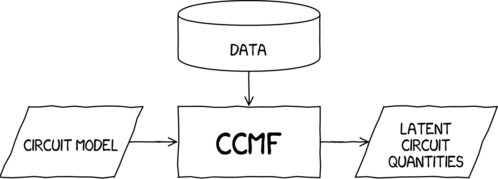

# ccmf
Circuit constrained matrix factorization

<div align="center">
  <a href="https://ccmf.readthedocs.io/en/latest/"> </a>
</div>

## Installing

**Install using pip:**

```sh
pip install ccmf
```

## Usages
Refer to [examples](/examples) for usages.

## Documentation
* https://ccmf.readthedocs.io/en/latest/
